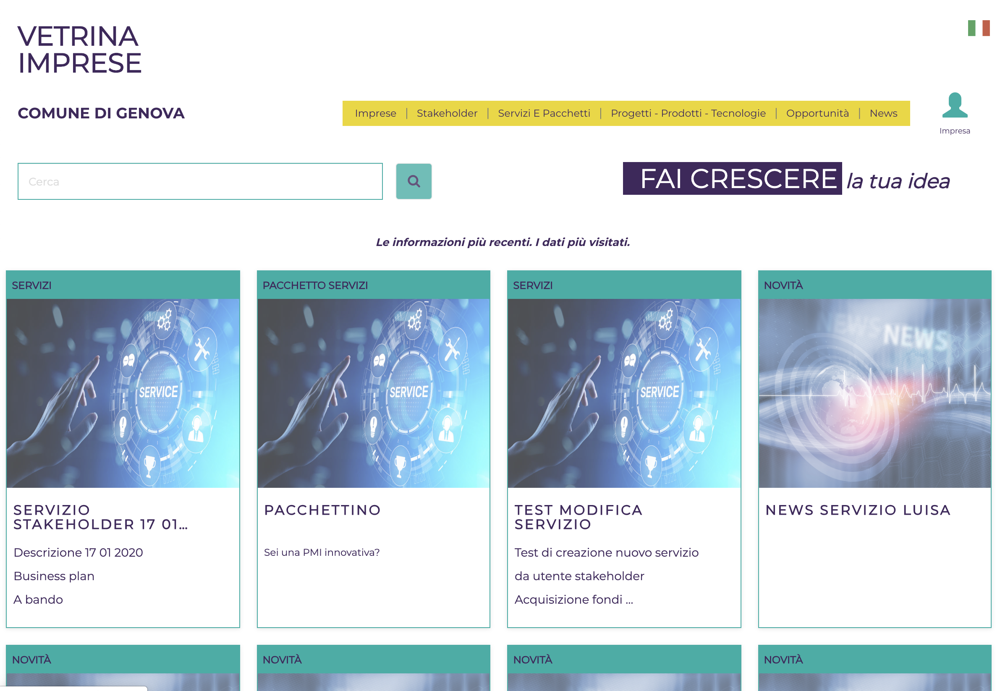

# VIMP - Vetrina Imprese

Next documentation is in Italian because the system has been developed for an Italian public administration.

## Introduzione

L’asse 1 “Agenda Digitale Metropolitano” del Piano Operativo della Città di Genova (PON Metro Genova) ha svolto rilevanti interventi per avanzare l’intero processo di produzione di servizi a cittadini e imprese presenti sul territorio, tra le quali ritroviamo lo sviluppo della piattaforma "Vetrina impresa" volta a garantire funzionalità legate alle tematiche del lavoro, con particolare riguardo agli ambiti dell’innovazione tecnologica, dell’industria creativa, dello sviluppo turistico culturale del territorio, della promozione dell’occupazione, dell’internalizzazione del mondo del lavoro, dello sviluppo di nuove professionalità e nuovi mercati. Il sistema permette, alle imprese accreditate, di inserire informazioni volte a pubblicizzare le proprie attività ed eventi di particolare interesse e di poter ricercare i vari servizi svolti sul territorio dagli stakeholder che hanno aderito al progetto. Si vuole pertanto uniformare le modalità di accesso di imprese, professionisti alle pratiche, ai servizi, ai sistemi, favorire la condivisione dei dati tra i vari stakeholder, ridurre i tempi e semplificare le modalità di espletamento delle varie attività al fine di incrementare la qualità, l’efficienza e l’efficacia del servizio erogato creando un ambiente sempre più favorevole allo sviluppo e alla rapida realizzazione di un’idea imprenditoriale con evidenti ricadute sul tessuto economico e produttivi, in particolare per le più piccole, giovani i in fase di start-up
Il sistema è stata realizzato dall'impresa [Interlogic S.r.l.](http://www.pro-logic.it).

Link alle pagine relative al progetto:

[Ponmetro Comune di Genova](https://smart.comune.genova.it/ponmetro)

Accesso all'applicativo [Vetrina Imprese](https://vetrinaimprese.comune.genova.it/vimp/home)

## Struttura del repository
Le principali cartelle usate dal repository sono

* img: cartella con le immagini usate dall'applicazione
* buildfiles: file di configurazione per ambiente di destinazione
* lib: librerie utilizzate
* src: sorgenti e files di configurazione

Documentazione allegata:

* [Modello database](./doc/ModelloDatabase.md)
* [Manuale utente amministratore](./doc/ManualeUtenteAmministratore.md)
* [Manuale utente accreditato](./doc/ManualeUtenteAccreditati.md)
* [Manuale utente accesso libero](./doc/ManualeUtenteAccessoLibero.md)

## System requirements

The application this project produces is designed to be run on JBoss Enterprise Application Platform - Version 6.2.0.GA.

All you need to build this project is Java 6.0 (Java SDK 1.6) , Apache Ant 1.9.2.

	
Database configuration into JBoss Server

Configure datasource on the JBoss Server, for example: 

	<datasources>
	  <datasource jndi-name="java:/vimp/vimpDS" pool-name="vimpds" enabled="true" use-java-context="true">
	    <connection-url>jdbc:h2:file:./vimp/H2database/test.h2.db;DB_CLOSE_DELAY=-1;DB_CLOSE_ON_EXIT=FALSE</connection-url>
	    <driver>h2</driver>
	    <security>
	      <user-name>sa</user-name>
	      <password>sa</password>
	    </security>
	  </datasource>
	  <drivers>
	    <driver name="h2" module="com.h2database.h2">
	      <xa-datasource-class>org.h2.jdbcx.JdbcDataSource</xa-datasource-class>
	    </driver>
	    <driver name="sqlserver" module="com.microsoft">
	      <xa-datasource-class>com.microsoft.sqlserver.jdbc.SQLServerXADataSource</xa-datasource-class>
	    </driver>
	  </drivers>
	</datasources>

##Start the JBoss Server

Start the JBoss Server with Custom Options. You will need to provide the argument string to pass on the command line, for example: 

      `--server-config=../../docs/examples/configs/standalone.xml`

##Build and Deploy VIMP

1. Import and copy into lib folder necessary [libraries](./libraries.md)
2. Make sure you have started the JBoss Server as described above.
2. Open a command line and navigate to the root directory of this project.
3. Type this command to build the archive:

        ant -Dtarget=tst package-ear
4. This will deploy `target/build/archives/tst/vimp.ear` to the running instance of the server.
 

 
## Accesso all'applicazione tramite credenziali SPID

L'accesso all'applicazione è consentito con il sistema SPID per gli utenti esterni

La gestione dell'autenticazione è garantita dal sistema SIRAC SSO che è definito tra i service provider SPID 
(https://registry.spid.gov.it/service-providers)

Noto il CF dell'utente il sistema verifica in una tabella del DB l'appartenenza dell'utente tra quelli di sistema.

## Copyleft and License

This web page was developed starting from [Start Bootstrap](http://startbootstrap.com/) - [SB Admin 2](http://startbootstrap.com/template-overviews/sb-admin-2/)

[SB Admin 2](http://startbootstrap.com/template-overviews/sb-admin-2/) is an open source, admin dashboard template for [Bootstrap](http://getbootstrap.com/) created by [Start Bootstrap](http://startbootstrap.com/).
which  use the following license: Copyright 2013-2018 Blackrock Digital LLC. Code released under the [MIT](https://github.com/BlackrockDigital/startbootstrap-sb-admin-2/blob/gh-pages/LICENSE) license.

Start Bootstrap was created by and is maintained by **[David Miller](http://davidmiller.io/)**, Owner of [Blackrock Digital](http://blackrockdigital.io/).

* https://twitter.com/davidmillerskt
* https://github.com/davidtmiller

Start Bootstrap is based on the [Bootstrap](http://getbootstrap.com/) framework created by [Mark Otto](https://twitter.com/mdo) and [Jacob Thorton](https://twitter.com/fat).

[Interlogic S.r.l.](http://www.pro-logic.it) change the license to GPL v.3 (see license file attached)

This work is financed by [PON Metro 2014-2020](http://www.ponmetro.it) funding.

## Versioning

La prima versione stabile è stata creata nel marzo 2020 all'atto dell'inserimento del SW nel catalogo del riuso.

Il progetto è stabile al netto di continue migliorie e bug detection che sono possibili attraverso l'uso dell'ambiente in produzione presso il Comune di Genova

Il soggetto detentore del software è il Comune di Genova

## Contatti

* Amministrazione proprietaria: Comune di Genova
* Contatto e-mail referente di progetto (per segnalazioni e richiesta informazioni): [gestionesistemi@comune.genova.it](mailto:gestionesistemi@comune.genova.it)
